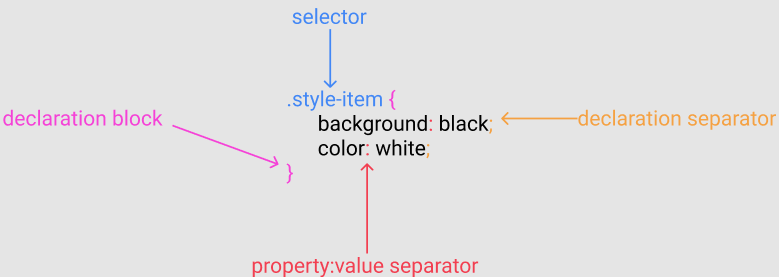

<div align="center">
   <h1>HTML and CSS - Quick Reference and Samples</h1>
</div>
<br>
<div align="center">
    
        
</div>

# CSS:

## Tips and best practices:

### Usage

:-1:

* Do not add CSS inline! Even though it is possible. :point_right: ```<div style="color:red">```
    * It is a bad practice 
    * You will have to style each element separately
    * It is not efficient
    * It is not scalable
    * Using !important will break the styles "cascade" that elements do down from one to another, avoid using it as much as possible or you can end up losing hours trying to   figure out what's the problem.


**************************

:exclamation:

* Internal is better, but not optimal :point_right: ```<style></style>```
    * you can add a <style> tag to the HTML where the elements will be styled, but it can only be used in one file
    * which will make the the file larger

**************************

:thumbsup:

* External is the Best :point_right: ``` <link href="style.css"> ```
    * Keeps the styles separate from HTML
    * Improve readability and reusability
    * Using ID instead of classes where it makes sense, it's a faster way for the browser to access DOM elements
    * Use the browser inspector to "debug" your CSS, is easier to understand the hierarchy and identify what could be impacting
    * Use preprocessors to help optimize your CSS, carefull with spacing between selectors and between properties
    * Partition your CSS to make it more manageable and better readable. Each CSS file could be broken into logical components like header.css, footer.css, etc
    * Use good description for your selectors, make clear what your components are on the page. e.g: "header-left," "content-title," or "content-date"
    * Make some small comments in your CSS to understand how each style is related to another and what color scheme applies to which components
    * In case it's necessary to change something on a bigger project or that comes from a framework, create an .css file that explicitly overrides the element, add some comments to for better readability. 


#### Don't forget that CSS is read from top to bottom, so the order metters, e.g. 

In this example the last line will override all the other border attributes:
```
p {
    border-top: 5px solid blue;
    border-right: 2px dotted green;
    border-bottom: 5px dashed red;
    border-left: 2px dotted green;
    border: 3px solid green;
}
```

#### There are several ways for setting properties: 
```
p {
    padding-top: 10px;
    padding-right: 20px;
    padding-bottom: 10px;
    padding-left: 20px;

        /* OR defining the values started by the top and following clockwise */
    padding: 10px 20px 10px 20px;

       /* OR defininig the top and bottom as 10px and the left and right as 20px*/
    padding: 10px 20px;

       /* OR when the element has the same padding all around*/
    padding: 20px;
}
```

#### The box model properties:
* padding: used to generate space around an element's content, inside of any defined borders.  
* border: allow you to specify the style, width, and color of an element's border.  
* margin: used to create space around elements, outside of any defined borders.  
* content: the element itself.


**************************

### Selector diagram:



**************************

### Colors and Fonts:

#### how you can define the color of your HTML elements:

* HTML color names: e.g. red, blue, yellow, etc.
* Hexadecimal: ```#FF652F```
    * when code has the same number repeated 6 times ->  #333 is the same as #333333
* rgb/rgba
    * red, green, blue -> ```rgb(255, 202, 47)``` 
    * red, green, blue, alpha(defines the transparency of the image) -> ```rgba(255, 101, 47, 1)```
    * A good resource to pick the right [color](https://htmlcolorcodes.com/)
    * A good resource to pick some beautiful [color combinations](https://www.canva.com/learn/100-color-combinations/)

#### Web Safe Fonts:  
The font-family property should hold several font names as a "fallback" system, to ensure maximum compatibility between browsers/operating systems. If the browser does not support the first font, it tries the next font.  

Start with the font you want, and end with a generic family, to let the browser pick a similar font in the generic family, if no other fonts are available:  

* works in all browsers, eg:. Arial, Helvetica, Times Nem Roman, Verdana  
* ```font-family: Arial, Helvetica, sans-serif``` -> to ensure a fallback of the fonts, in case one of them is not available.  

**************************

### Units and measurement:  
* Absolute units : physical units of lenght eg:. ```px```; Absolute length units approximate the actual measurement on a screen  
* Relative units, are relative to another length value eg:. ```em``` is based on the size of an element's font -> if the font size is 16px then 1em would equal 16px. 0.5em would equal to 8px.

#### Absolute Lengths:  
Unit| Description
-------------------|------------------------------------------------
cm  |centimeters
mm  |millimeters
in  |inches (1in = 96px = 2.54cm)
px *|pixels (1px = 1/96th of 1in)
pt  |points (1pt = 1/72 of 1in)
pc  |picas (1pc = 12 pt)

#### Relative Lengths:  
Unit| Description
-------------------|-------------------------------------------------------------------------
em  |Relative to the font-size of the element (2em means 2 times the size of the current font)	
ex  |Relative to the x-height of the current font (rarely used)	
ch  |Relative to the width of the "0" (zero)	
rem |Relative to font-size of the root element	
vw  |Relative to 1% of the width of the viewport*	
vh  |Relative to 1% of the height of the viewport*	
vmin|Relative to 1% of viewport's* smaller dimension	
vmax|Relative to 1% of viewport's* larger dimension	
%	|Relative to the parent element

**************************

### Identifiyng the element on it's respective CSS file:

* id : starts with ```#``` ->  indicates that that element is being used only one time (it is unique at your page)
```
    #mainHeader {
        ....
    }
```

* class: starts with ```.``` ->  indicates that that element is being used multiple times in different places at your page.
```
    .container {
        ....
    }
```
**************************

### Ensuring responsiveness

It is called responsive web design when you use CSS and HTML to resize, hide, shrink, enlarge, or move the content to make it look good on any screen.

* Responsive web design makes your web page look good on all devices.
* Responsive web design uses only HTML and CSS.
* Responsive web design is not a program or a JavaScript.

* Tools to ensure responsiveness:

 **Viewport:**  
 A meta viewport tag gives the browser instructions on how to control the page's dimensions and scaling.  
 Using the meta viewport value width=device-width instructs the page to match the screen's width in device-independent pixels.  

 **Grid View:**  
 The Grid View devide the page space into columns, making easier to distribute the elements on the page.  
 A responsive grid-view often has 12 columns, and has a total width of 100%, and will shrink and expand as you resize the browser window.  

 **Media Queries:**  
 Media query is a CSS technique introduced in CSS3.  
 It uses the @media rule to include a block of CSS properties only if a certain condition is true, for instance, if the screen size is smaller than 400px.  

 **Width:**  
 If the width property is set to a percentage and the height is set to "auto", the element will be responsive and scale up and down, it is useful for instance to scale   
 an image or video on the scree.  

**************************

### [Reset style sheet](https://en.wikipedia.org/wiki/Reset_style_sheet)

* A reset stylesheet (or CSS reset) is a collection of CSS rules used to clear the formatting of HTML elements.

#### Notable reset style sheets

* [Eric A. Meyer's CSS Reset](https://meyerweb.com/eric/tools/css/reset/)
* [Normalize.css](http://necolas.github.io/normalize.css/)

**************************

### CSS Sprites

* [CSS Sprites: What They Are, Why They’re Cool, and How To Use Them](https://css-tricks.com/css-sprites/)
* [CSS Image Sprites](https://www.w3schools.com/css/css_image_sprites.asp)

**************************

### Preprocessor style sheet language

* [Sass - Syntactically awesome style sheets](https://sass-lang.com/)
* [Less - Leaner style sheets](http://lesscss.org/)
* [Stylus](https://stylus-lang.com/)

**************************

### UI Patterns:

* Google: [Material Design](https://material.io/design)
* Apple: [Human Interface Guidelines](https://developer.apple.com/design/human-interface-guidelines/)
* Twitter: [Bootstrap](https://getbootstrap.com/)
* Design Patterns Libraries for mobile: [Mobbin](https://mobbin.design/)

**************************

### Style Guides:

* [Toyota](https://www.toyota.com/brandguidelines/)
* [Uber](https://www.uber.com/de/de/careers/design/)
* [AirBnb](https://airbnb.design/)

**************************

### Useful tools:

* [Chrome DevTools](https://developers.google.com/web/tools/chrome-devtools)

**************************

### Color Schemes:

* [Visme](https://visme.co/blog/website-color-schemes/)
* [colors.lol](https://colors.lol/)
* [uiGradients](https://uigradients.com/)